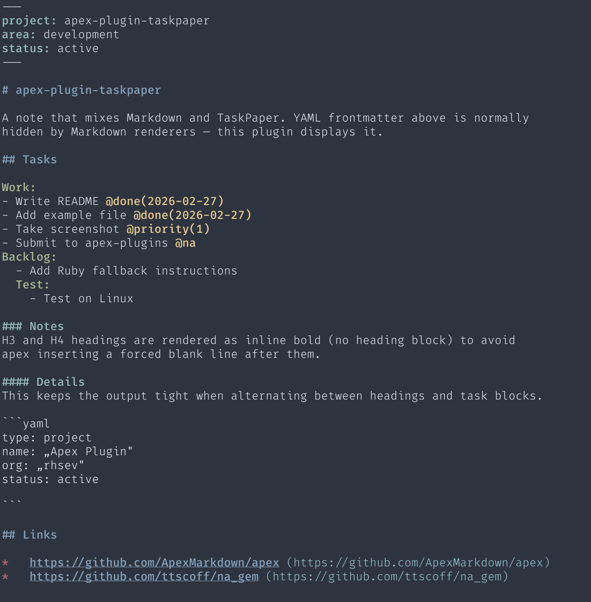

# apex-plugin-taskpaper

An [apex](https://github.com/ApexMarkdown/apex) `pre_parse` plugin for using TaskPaper task management inside Markdown files.

## The idea

Markdown is a suitable format to manage notes, tasks and data. Tasks are managed with [na](https://github.com/ttscoff/na_gem) (Brett Terpstra's next-action tool). TaskPaper-style tasks live right inside the note files, indented with tabs under a project header. This works well for `na`, but Markdown interprets tab-indented content as code blocks. 

This plugin teaches apex to read that structure as intended: project headers stand out visually, tasks preserve their nesting level, and `@tags` are immediately recognizable. TaskPaper is rendered as plain text with hard line breaks. This keeps the output tight and the indentation intact.

YAML frontmatter, normally hidden by Markdown renderers, is displayed too, since the tool [grubber](https://github.com/rhsev/grubber) uses it alongside YAML code blocks as data sources.

## What it does

| Input | Output |
|---|---|
| `Project:` (line ending with `:`) | bold + cyan, top-level |
| `\tSub Project:` (indented `:`) | bold + green, indented |
| `\t- Task @done` | `- Task @done`, indented, `@done` colored |
| `### Section` | bold `\#\#\# Section`, no heading block |
| `#### Sub` | bold `\#\#\#\# Sub`, no heading block |
| `# Title` / `## Header` | standard Markdown H1/H2 |
| YAML frontmatter | `key: value` pairs, keys colored |

H1/H2 become real Markdown headings. H3/H4 are rendered as inline bold to avoid the blank line apex inserts after heading blocks, keeping them visually distinct without disrupting flow.

## Screenshot



## Example

See [`example.taskpaper.md`](example.taskpaper.md) in this repo.

## Theme configuration

Add `span_classes` to your apex terminal theme (e.g. `~/.config/apex/terminal/themes/mytheme.theme`):

```yaml
span_classes:
  h3text: b bright_cyan    # top-level project headers, H3 headings
  h4text: b bright_green   # nested project headers, H4 headings
  atag:   b yellow         # @tags
  fmkey:  b cyan           # frontmatter keys
```

`b` = bold. Use with:

```bash
apex file.md --plugins -t terminal256 --theme mytheme
```

## Companion plugin: atag

The `@tag` highlighting referenced in the theme config above is handled by a separate companion plugin. It wraps `@tag` and `@tag(value)` syntax in a bracketed span with class `atag` — independently of the TaskPaper structure, so it works in any Markdown file.

Copy [`atag_plugin.yml`](atag_plugin.yml) from this repo to `~/.config/apex/plugins/atag/plugin.yml`.

## Requirements

- [apex](https://github.com/ApexMarkdown/apex) ≥ 0.1.83
- [Crystal](https://crystal-lang.org) for compiling the binary on install

## Installation

```bash
apex --install-plugin https://github.com/rhsev/apex-plugin-taskpaper.git
```

The `post_install` step compiles the Crystal binary automatically.

A pre-compiled macOS arm64 binary is available as a [GitHub Release asset](https://github.com/rhsev/apex-plugin-taskpaper/releases) if you prefer not to compile.

## Limitations

- **Paragraph breaks inside a project block**: each project and its tasks form a single paragraph via hard line breaks. A blank line separates sections, which is usually the right behavior in TaskPaper, but it means you can't have multi-paragraph content within a project block.
- **Project depth**: nesting is tracked at any depth, but only two visual levels are distinguished: top-level projects (`h3text`) and all nested projects (`h4text`). Deeper nesting gets indentation but the same color as level 2.

## Implementation: Ruby vs. Crystal

The repo includes two implementations with identical logic:

| File | Language | Use |
|---|---|---|
| `taskpaper_plugin.rb` | Ruby | Reference implementation, portable, easy to read and modify |
| `taskpaper_plugin.cr` | Crystal | Compiled to native binary, used as the actual handler |

Performance (hyperfine, on this machine):

```
apex file.md --plugins   →  ~90 ms with Ruby-plugin
apex file.md --plugins   →  ~26 ms with Crystal-plugin
apex file.md             →  ~11 ms
```

The ~15 ms overhead is mostly based on the Inter-Process Communication, not the transformation by the Crystal plugin itself. 

If you prefer to use the Ruby script directly, change `plugin.yml`:

```yaml
handler:
  command: "ruby ${APEX_PLUGIN_DIR}/taskpaper_plugin.rb"
```

This removes the Crystal dependency entirely.
